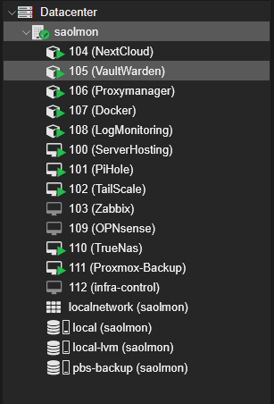
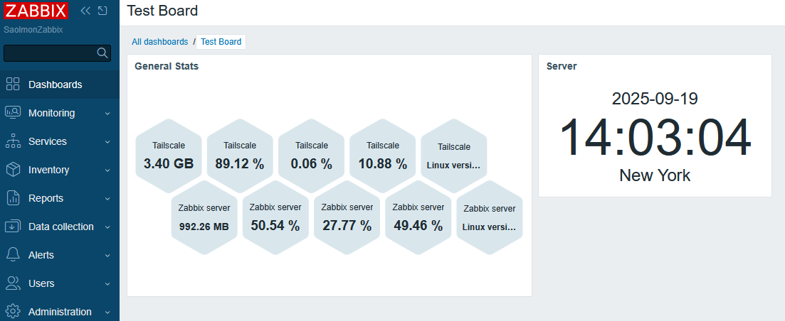
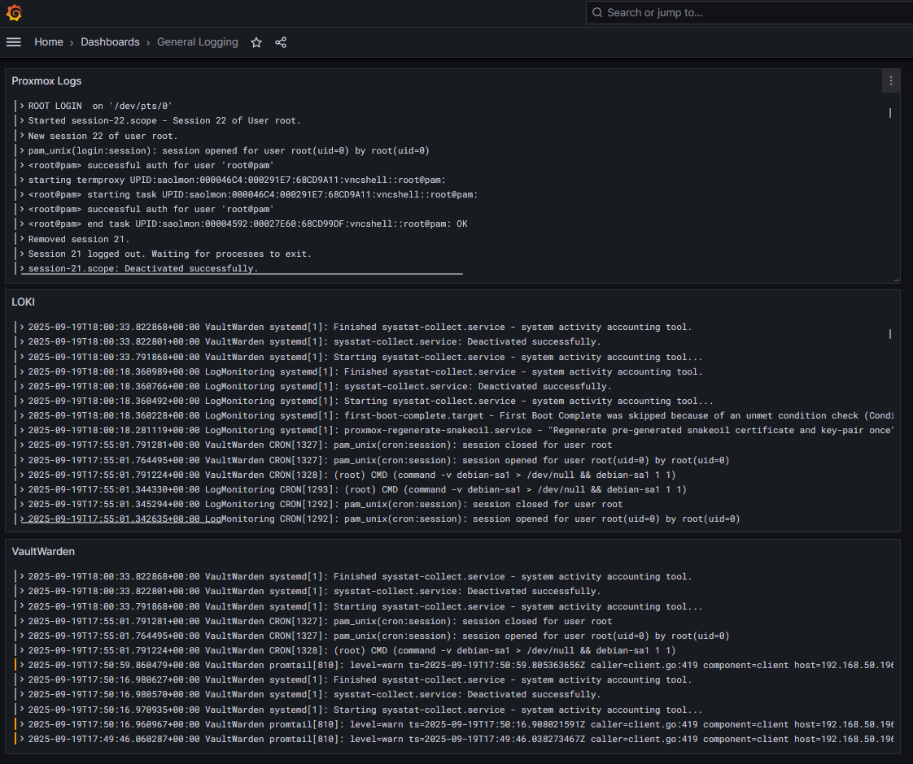
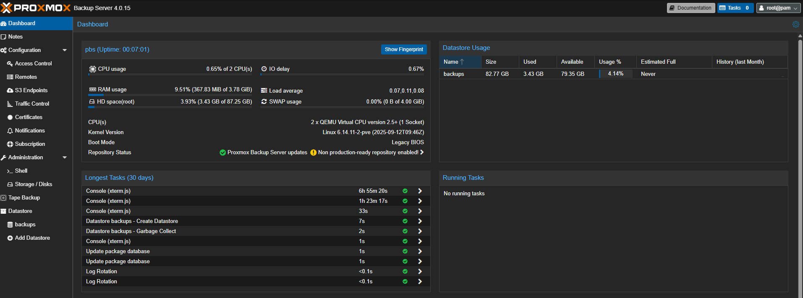
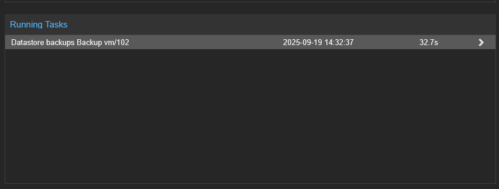
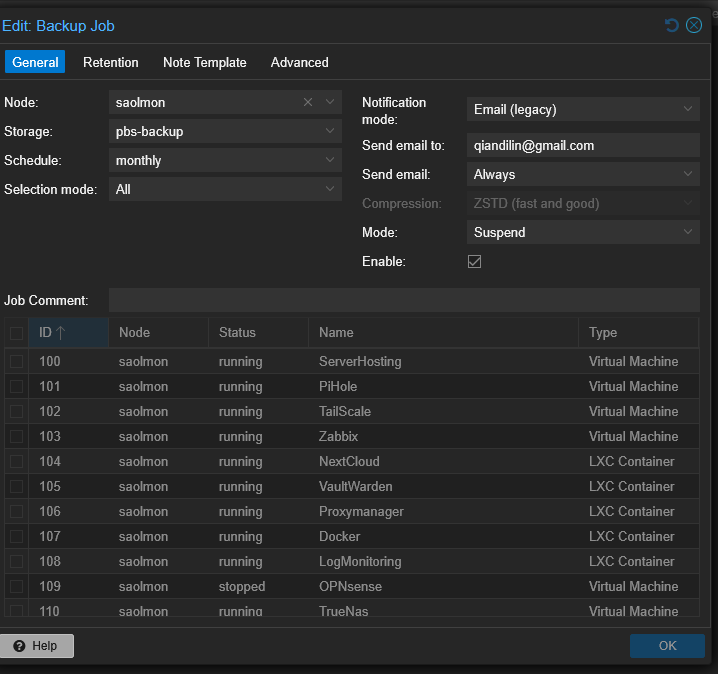

# 🖥️ Homelab Infrastructure Lab

## Overview
I designed and maintain a **virtualized datacenter homelab** to simulate enterprise infrastructure.  
This lab helps me practice real-world **systems administration, networking, automation, and security** skills.

## 🎯 Why I Built This Homelab

I enjoy the process of taking an empty server and building it up into a fully functional environment.  
My goal was to create a set of utilities I use on a daily basis while also practicing skills that mirror the responsibilities I’d face in an enterprise job environment.  

This homelab allows me to:
- Continuously expand and improve my setup, seeing real progress over time  
- Run practical tools I rely on every day (file sharing, password management, monitoring, VPN access)  
- Gain hands-on experience with the same technologies used in professional IT environments  
- Experiment safely with automation, security, and networking concepts before applying them in production-like scenarios  

---

## 🌐 Network Topology

- VLANs for **Management, Proxmox, Home Devices, and Lab/Test traffic**  
- Remote access secured with **TailScale VPN**
- Reverse proxy with xgnix

📷 *Add a **diagram of your network topology** here (router → switch → Proxmox → VMs/VLANs).*  
Example:  
``

---
## ⚙️ Virtual Machines & Services

- **Proxmox Backup Server** – Automated VM/container snapshots  
  > *I learned how to schedule and test backups for disaster recovery and simulate enterprise backup workflows.*  

- **TrueNAS (ZFS)** – Storage & backup server  
  > *Working with ZFS helped me understand RAID levels, snapshots, and storage pooling for reliability.*  

- **NextCloud** – Self-hosted collaboration and file sync  
  > *This gave me hands-on experience with reverse proxies and SSL certificates to securely expose services.*  

- **VaultWarden** – Password manager  
  > *Running VaultWarden reinforced best practices for secrets management and container security.*  

- **Zabbix** – Monitoring and alerting  
  > *First experience into monitoring virtual machines and containers in my network.*  

- **Docker Host** – Containerized apps  
  > *Experimenting with Docker helped me understand container lifecycle, networking, and persistent storage.*

- **OPNsense** - Firewall, routing, VLAN segementation
  > *Work in progress, eventually this will be the main router with firewall, and the current router will be access point.*

- **LogMonitoring (Loki–Grafana/Promtail)** – Centralized logging and observability  
  > *Setting up Loki with Promtail and Grafana taught me how to collect logs from multiple systems, query them efficiently, and visualize trends in real time for troubleshooting.*  

 

---

## 🔑 Key Features
- **Virtualization & Orchestration** → Multi-node VM and container management via Proxmox  
- **Network Security** → VLAN segmentation, firewalling, VPN access  
- **Monitoring & Observability** → Centralized metrics and logs (Zabbix, log monitoring)  
- **Backup & Storage** → Disaster recovery with PBS and ZFS snapshots  
- **Automation** → Infrastructure-as-Code with Ansible/Terraform

(I found that using the summary tab on Proxmox Webinterface more convenient since I was able to access the command line directly if I need to fix any deployments) 

(I also set up Grafana via Loki and Pormtail. This I found as a great excerise for deploying agents, writing configs, and learning to pull logs from Virtual Machines. More in the next project)

I also set up a backup server.

It would backup one container at a time.

Here is the Backup Job for it

---

## 🛠️ Skills Gained
- Virtualization & containerization (Proxmox, Docker, LXC)  
- Linux administration & self-hosted services  
- Network engineering (VLANs, OPNsense firewall, VPN)  
- Storage & backup management (TrueNAS, PBS)  
- Infrastructure automation (Ansible, Terraform)

👉 *(Here you can add a closing paragraph: “This project demonstrates my ability to design and manage complex infrastructure similar to enterprise environments.”)*

---
