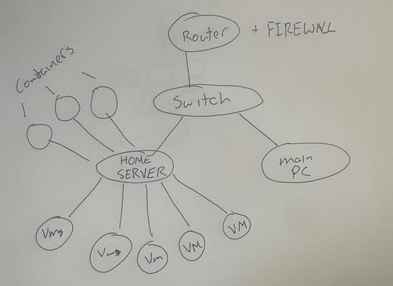
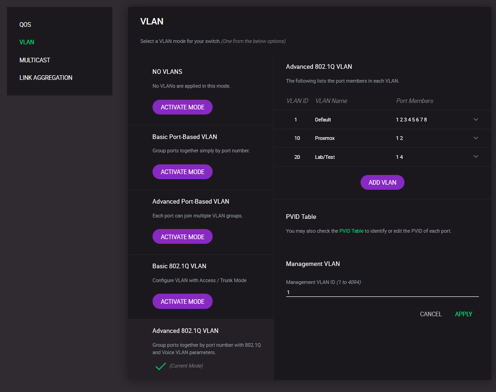
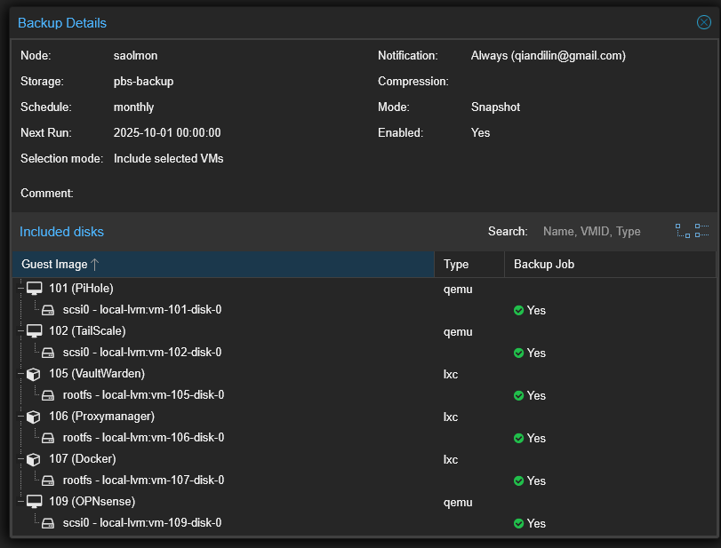

# 🖥️ Home Infrastructure Lab

## Overview
I designed and maintain a **virtualized datacenter homelab** to simulate enterprise infrastructure.  
This lab helps me practice real-world **systems administration, networking, automation, and security** skills.

## 🎯 Why I Built This Homelab

I enjoy the process of taking an empty server and building it up into a fully functional environment.  
My goal was to create a set of utilities I use on a daily basis while also practicing skills that mirror the responsibilities I’d face in an enterprise job environment.  

This homelab allows me to:
- Continuously expand and improve my setup, seeing real progress over time  
- Run practical tools I rely on every day (file sharing, password management, monitoring, VPN access)  
- Gain hands-on experience with the same technologies used in professional IT environments  
- Experiment safely with automation, security, and networking concepts before applying them in production-like scenarios  

---

## 🌐 Network Topology

- VLANs for **Management, Proxmox, Home Devices, and Lab/Test traffic**  
- Remote access secured with **TailScale VPN**
- Reverse proxy with xgnix

VLANs separating main network with ones for just proxmox, one for other labs and services, and main network for all my home devices.

Nginx proxy for services that I use/monitor in a consistent basis

---
## ⚙️ Virtual Machines & Services

- **Proxmox Backup Server** – Automated VM/container snapshots  
  > *I learned how to schedule and test backups for disaster recovery and simulate enterprise backup workflows.*  

- **TrueNAS (ZFS)** – Storage & backup server  
  > *Working with ZFS helped me understand RAID levels, snapshots, and storage pooling for reliability.*  

- **NextCloud** – Self-hosted collaboration and file sync  
  > *This gave me hands-on experience with reverse proxies and SSL certificates to securely expose services.*  

- **VaultWarden** – Password manager  
  > *Running VaultWarden reinforced best practices for secrets management and container security.*  

- **Zabbix** – Monitoring and alerting  
  > *First experience into monitoring virtual machines and containers in my network.*  

- **Docker Host** – Containerized apps  
  > *Experimenting with Docker helped me understand container lifecycle, networking, and persistent storage.*

- **OPNsense** - Firewall, routing, VLAN segementation
  > *Work in progress, eventually this will be the main router with firewall, and the current router will be access point.*

- **LogMonitoring (Loki–Grafana/Promtail)** – Centralized logging and observability  
  > *Setting up Loki with Promtail and Grafana taught me how to collect logs from multiple systems, query them efficiently, and visualize trends in real time for troubleshooting.*

- **Game Server Hosting** – Dedicated VM for hosting multiplayer services  
  > *Hosting game servers taught me about resource allocation, port forwarding, container isolation, and user access management. It also gave me experience monitoring performance under load and ensuring uptime for external users.*  

---

## 🔑 Key Features
- **Virtualization & Orchestration** → Multi-node VM and container management via Proxmox  
- **Network Security** → VLAN segmentation, firewalling, VPN access  
- **Monitoring & Observability** → Centralized metrics and logs (Zabbix, log monitoring)  
- **Backup & Storage** → Disaster recovery with PBS and ZFS snapshots  
- **Automation** → Infrastructure-as-Code with Ansible/Terraform

(I found that using the summary tab on Proxmox Webinterface more convenient since I was able to access the command line directly if I need to fix any deployments) 

(I also set up Grafana via Loki and Pormtail. This I found as a great excerise for deploying agents, writing configs, and learning to pull logs from Virtual Machines. More in the next project)

I also set up a backup server.

It would backup one container at a time.

Here is the Backup Job (I am backing up all the virtual machines and containers I see as important monthly to the backup server's storage)

---

## 🛠️ Skills Gained
- Virtualization & containerization (Proxmox, Docker, LXC)  
- Linux administration & self-hosted services  
- Network engineering (VLANs, OPNsense firewall, VPN)  
- Storage & backup management (TrueNAS, PBS)  
- Infrastructure automation (Ansible, Terraform)

*This homelab is more than a personal project, it’s a practical demonstration of my ability to build and manage enterprise-grade infrastructure on my own. By designing a full-stack environment with virtualization, networking, monitoring, and backups, I’ve proven I can deliver reliable, secure, and maintainable systems from the ground up. The same skills I use here: troubleshooting, performance tuning, and security hardening directly translate to professional IT operations. I view this lab as both a testing ground for new technologies and as proof of my capability to take ownership of complex infrastructure, continuously improve it, and keep it running smoothly.*

---
